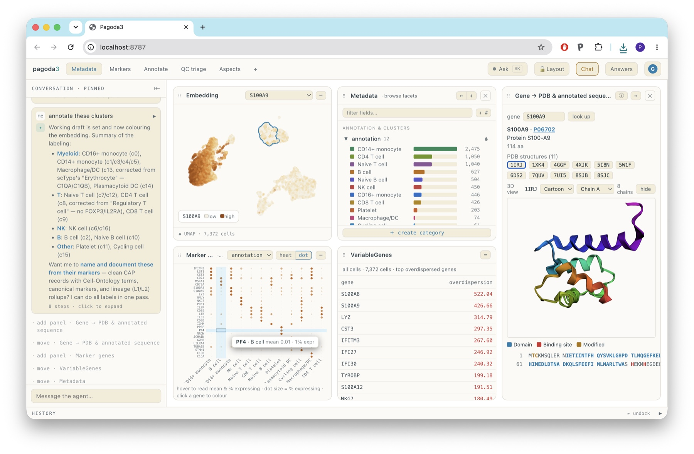

# pagoda3

**An agent-driven, browser-native viewer for single-cell data.** Open a dataset — its embedding, your
clusters, your metadata — and *explore it by talking to it*. A built-in copilot (Anthropic's Claude)
recolours, refocuses, runs the right analysis, arranges panels, and even builds new ones on request, so
you spend your time looking at the data instead of hunting through menus.

<p align="center">
  
</p>

Nothing is uploaded — your data is read in the browser, or served from your own machine. Runs on a
laptop; scales to a lab server.

## What you can open

Drag any of these onto the window — read locally, nothing leaves your machine:

- **AnnData** — `.h5ad`
- **10x Cell Ranger** — a `.h5`, or a `matrix.mtx` / `barcodes.tsv` / `features.tsv` **triplet** (single-
  or multi-sample; it lists the samples and lets you pick one)
- a native **`.lstar.zarr`** store — a folder or a `.zip`

…or, from an **R / Python** session, hand the launcher a live object — **Seurat**,
**SingleCellExperiment**, **AnnData**, or an lstar dataset — and it converts and opens it (see *Use it*).

A bare counts matrix is enough: if there's no embedding or clusters yet, pagoda3 normalizes, lays out,
clusters, and finds markers in the browser on the way in.

## Explore it by asking

pagoda3 is a **generative** viewer. Almost everything you can see — which panels exist and how they're
arranged, what they're coloured by, which cells are in focus, which contrast a test uses, even entirely
new custom panels — is *state the copilot can set*. So instead of clicking through options you say what
you want to see: the agent composes the view, picks and runs the right computation, lays out the result,
and tells you the caveats. Every one of those knobs is still yours to drive by hand — the agent just
reaches them faster, and can **optimise** them for the question you actually asked.

A few things you can just ask for:

- **"facet by day"** — splits the embedding into aligned per-timepoint panels that share axes and
  colours, so you compare like with like.
- **"what are the DE genes separating the patients within the T cells?"** — focuses to T cells, runs a
  *donor-level* (pseudobulk) differential test **across patients** with real p-values, and flags that the
  patient — not the cell — is the replicate.
- **"colour by S100A9 and show its markers"**, **"cluster 7 vs the rest"**, **"annotate these
  clusters"** — the everyday moves, one sentence each.
- **build a custom panel.** Ask for something the built-ins don't do and the agent *writes it* — a small,
  sandboxed widget that runs live in the workbench and stays in sync with every other panel. The
  **Gene → PDB** panel on the right of the screenshot came from one such request: *"for the gene I'm
  colouring by, pull its PDB structures and show the 3D fold and annotated sequence"* — the agent
  authored a widget that fetches from RCSB/UniProt and renders the structure in 3D.

Because the agent drives real state rather than a fixed script, it also knows when *not* to trust a
result — it will pick a grouping that actually has markers, use the statistically correct test for a
cross-sample comparison, and refuse or caveat a comparison that a 1-vs-1 design can't support.

## Use it

**From R** — view a Seurat/SCE object, or an existing store:

```r
library(pagoda3)
view(seurat_obj)             # convert -> prepare -> serve -> open in the browser
view("sample.lstar.zarr")    # or an existing L* store
```

**From Python** — an AnnData, an `lstar.Dataset`, or a store path:

```python
import pagoda3
pagoda3.view(adata)
pagoda3.view("sample.lstar.zarr")
```

(Already in an lstar session? `lstar::view()` / `lstar.view()` hand straight off to pagoda3.)

**In the browser** — open the viewer and **drag a file on**. Nothing is uploaded; the bytes are read
locally. Zero setup for a quick look.

**Share / deploy on a static host** — the viewer is a static single-page app that reads a store over
ordinary HTTP **range requests**, so there is *no server-side compute*. Prepare a store once (a quick
`write_viewer` precomputes the navigators so it opens instantly), drop the store **and** the built bundle
on any static file server — a lab web directory, S3, GitHub Pages — and share a `?store=…` deep-link.
Recipients explore it in their own browser, fetching only the bytes they scroll to; the data is never
uploaded anywhere.

**Develop it** — run the dev server directly:

```bash
../.venv/bin/python examples/make_dev_store.py   # -> web/public/sample.lstar.zarr (synthetic demo)
cd web && npm install && npm run dev             # -> http://localhost:8787  (agent proxy auto-spawns)
```

## What's inside

- **Coordination space + generative viewer** — colour/focus the shared scope, a disposable answer
  rail + pinning, workspaces, the timeline-as-transcript, command palette, handle-borne provenance
  with **cacoa caveats** (sample-is-replicate, compositional, pseudobulk, refuse/caveat 1-vs-1).
- **Scope-correct compute** — selection DE ranks **all genes** for the selected cells; overdispersion
  is the pagoda2-style residual above a smoothed mean-variance trend, **recomputed for the scope**
  (never a global gene shortlist). Both subsample cells, read cell-major rows, reduce over all genes.
- **The agent** — a Claude tool-use loop with a **data-driven** system prompt (read from the loaded
  store), driving the coordination space at the lowest sufficient rung.

## Layout

```
web/             the browser viewer (Vite + TS): src/{data,render,ui,agent}, public/ (dev stores + /wasm)
py/              python package "pagoda3": write_viewer (prep) + view() launcher
r/               R package "pagoda3": write_viewer + view()
server/          proxy.mjs — local agent proxy (Anthropic Messages API relay)
examples/        demo data-prep scripts (make_dev_store.py, real-data pipelines)
```

## Status

Working locally on real data: a Seurat integration of two GSE192391 PBMC samples
(`examples/02_process_seurat_integrated.R` → 12,221 cells, 21 cell types). Remote zarr-over-HTTP
(cell_order + cell-block sharding + a shard-aware stratified sampler) and browser OAuth sign-in are
the next steps.

---

<sub>Built on the open **[L★ / lstar](../lstar)** single-cell data model and compute kernels.</sub>
